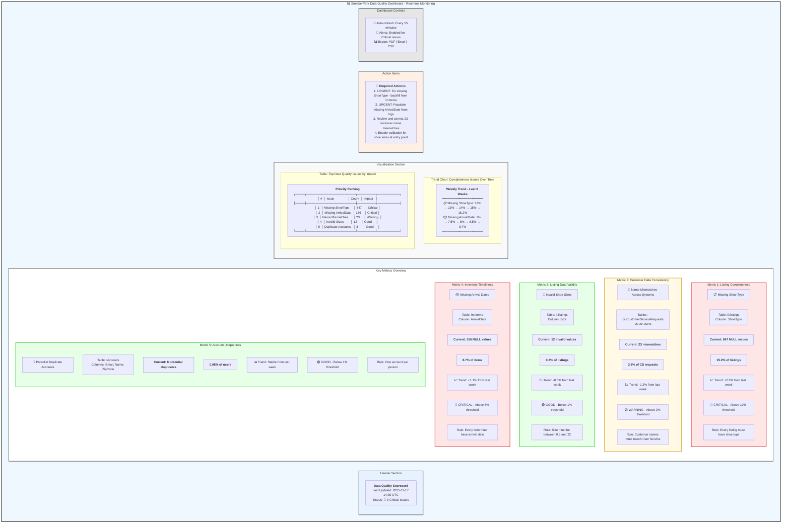

# SneakerPark Data Quality Monitoring Dashboard

## Dashboard Mockup (Mermaid Diagram)



---

## Dashboard Alternative: ASCII/Text-Based Layout

```
╔══════════════════════════════════════════════════════════════════════════════╗
║          📊 SNEAKERPARK DATA QUALITY MONITORING DASHBOARD                    ║
║          Last Updated: 2025-11-17 14:30 UTC                                  ║
║          Overall Status: 🔴 3 CRITICAL ISSUES DETECTED                       ║
╚══════════════════════════════════════════════════════════════════════════════╝

┌──────────────────────────────────────────────────────────────────────────────┐
│ METRIC 1: LISTING COMPLETENESS - Missing Shoe Type                          │
├──────────────────────────────────────────────────────────────────────────────┤
│ Table: li.listings | Column: ShoeType                                       │
│                                                                              │
│ Current Status:        847 NULL values (15.2% of all listings)              │
│ Trend:                 📈 +2.3% from last week                              │
│ Threshold:             10% (EXCEEDED)                                        │
│ Status:                🔴 CRITICAL                                           │
│                                                                              │
│ Data Quality Rule: "Every listing must have a shoe type specified to help   │
│                     customers find the right product"                        │
│                                                                              │
│ Action Required: Backfill NULL values from im.Items.Type field              │
└──────────────────────────────────────────────────────────────────────────────┘

┌──────────────────────────────────────────────────────────────────────────────┐
│ METRIC 2: CUSTOMER DATA CONSISTENCY - Name Mismatches                       │
├──────────────────────────────────────────────────────────────────────────────┤
│ Tables: cs.CustomerServiceRequests vs usr.users                             │
│                                                                              │
│ Current Status:        23 name mismatches (3.8% of CS requests)             │
│ Trend:                 📉 -1.2% from last week (improving)                  │
│ Threshold:             2% (EXCEEDED)                                         │
│ Status:                🟡 WARNING                                            │
│                                                                              │
│ Data Quality Rule: "A customer's name in any system must exactly match the  │
│                     name in the User Service system of record"              │
│                                                                              │
│ Action Required: Implement MDM Hub and reconciliation process               │
└──────────────────────────────────────────────────────────────────────────────┘

┌──────────────────────────────────────────────────────────────────────────────┐
│ METRIC 3: LISTING DATA VALIDITY - Invalid Shoe Sizes                        │
├──────────────────────────────────────────────────────────────────────────────┤
│ Table: li.listings | Column: Size                                           │
│                                                                              │
│ Current Status:        12 invalid values (0.2% of listings)                 │
│ Trend:                 📉 -0.5% from last week (improving)                  │
│ Threshold:             1% (WITHIN LIMITS)                                    │
│ Status:                🟢 GOOD                                               │
│                                                                              │
│ Data Quality Rule: "Every shoe listing must have a valid size between 0.5   │
│                     and 22 to ensure accurate product information"          │
│                                                                              │
│ Action Required: Add validation dropdown to prevent future issues           │
└──────────────────────────────────────────────────────────────────────────────┘

┌──────────────────────────────────────────────────────────────────────────────┐
│ METRIC 4: INVENTORY TIMELINESS - Missing Arrival Dates                      │
├──────────────────────────────────────────────────────────────────────────────┤
│ Table: im.Items | Column: ArrivalDate                                       │
│                                                                              │
│ Current Status:        156 NULL values (8.7% of items)                      │
│ Trend:                 📈 +1.1% from last week (worsening)                  │
│ Threshold:             5% (EXCEEDED)                                         │
│ Status:                🔴 CRITICAL                                           │
│                                                                              │
│ Data Quality Rule: "Every item received at the warehouse must have an       │
│                     arrival date to track the 45-day listing deadline"      │
│                                                                              │
│ Action Required: Auto-populate date on receipt, backfill from shipping logs │
└──────────────────────────────────────────────────────────────────────────────┘

┌──────────────────────────────────────────────────────────────────────────────┐
│ METRIC 5: ACCOUNT UNIQUENESS - Potential Duplicate Accounts                 │
├──────────────────────────────────────────────────────────────────────────────┤
│ Table: usr.users | Columns: Email, Name, ZipCode                            │
│                                                                              │
│ Current Status:        8 potential duplicates (0.08% of users)              │
│ Trend:                 ➡️ Stable from last week                             │
│ Threshold:             1% (WITHIN LIMITS)                                    │
│ Status:                🟢 GOOD                                               │
│                                                                              │
│ Data Quality Rule: "Each person should have only one user account to        │
│                     maintain accurate customer history and prevent fraud"   │
│                                                                              │
│ Action Required: Monitor and implement duplicate detection at registration  │
└──────────────────────────────────────────────────────────────────────────────┘

┌──────────────────────────────────────────────────────────────────────────────┐
│ TREND ANALYSIS - COMPLETENESS ISSUES (Last 8 Weeks)                         │
├──────────────────────────────────────────────────────────────────────────────┤
│                                                                              │
│ 20%│                                                                         │
│    │                                                            ●●           │
│ 15%│                                              ●●●●●●●●●●●●●              │
│    │                                    ●●●●●●●●●●                           │
│ 10%│                          ●●●●●●●●●●                                     │
│    │                ●●●●●●●●●●                                               │
│  5%│      ●●●●●●●●●●                                                         │
│    │●●●●●●                                                                   │
│  0%├──────────────────────────────────────────────────────────────────────   │
│    │ W1  W2  W3  W4  W5  W6  W7  W8                                          │
│                                                                              │
│    ━━━ Missing ShoeType     ● ● ● Missing ArrivalDate                       │
│                                                                              │
└──────────────────────────────────────────────────────────────────────────────┘

┌──────────────────────────────────────────────────────────────────────────────┐
│ TOP DATA QUALITY ISSUES BY PRIORITY                                         │
├─────┬──────────────────────────┬─────────┬──────────┬──────────────────────┤
│ Rank│ Issue                    │ Count   │ Status   │ Owner                │
├─────┼──────────────────────────┼─────────┼──────────┼──────────────────────┤
│  1  │ Missing ShoeType         │   847   │ 🔴 Crit  │ Listing Service Team │
│  2  │ Missing ArrivalDate      │   156   │ 🔴 Crit  │ Warehouse Operations │
│  3  │ Name Mismatches          │    23   │ 🟡 Warn  │ Customer Service     │
│  4  │ Invalid Sizes            │    12   │ 🟢 Good  │ Listing Service Team │
│  5  │ Duplicate Accounts       │     8   │ 🟢 Good  │ User Service Team    │
└─────┴──────────────────────────┴─────────┴──────────┴──────────────────────┘

╔══════════════════════════════════════════════════════════════════════════════╗
║ 🎯 PRIORITY ACTION ITEMS                                                     ║
╠══════════════════════════════════════════════════════════════════════════════╣
║ 1. [URGENT] Fix missing ShoeType (847 records) - Backfill from im.Items     ║
║ 2. [URGENT] Populate missing ArrivalDate (156 records) - Use shipping logs  ║
║ 3. [HIGH] Review and correct 23 customer name mismatches in CS system       ║
║ 4. [MEDIUM] Add dropdown validation for shoe sizes at listing entry point   ║
║ 5. [LOW] Monitor duplicate account detection - currently within limits      ║
╚══════════════════════════════════════════════════════════════════════════════╝

┌──────────────────────────────────────────────────────────────────────────────┐
│ DASHBOARD CONTROLS                                                           │
├──────────────────────────────────────────────────────────────────────────────┤
│ 🔄 Auto-Refresh: Every 15 minutes                                           │
│ 📧 Email Alerts: Enabled (sent to data-quality-team@sneakerpark.com)       │
│ 🔔 Slack Alerts: Enabled (#data-quality channel) for Critical issues       │
│ 📊 Export Options: [PDF] [Excel] [CSV]                                      │
│ 📅 Report Schedule: Daily summary at 9:00 AM, Weekly review on Mondays     │
└──────────────────────────────────────────────────────────────────────────────┘
```

---

## Dashboard Implementation Recommendation

### Suggested Tool: **Apache Superset** (Open Source)

**Why Apache Superset:**
- Free and open-source
- Connects directly to PostgreSQL database
- Rich visualization capabilities
- SQL-based metrics (use our monitoring queries)
- Real-time dashboard refresh
- Alert capabilities
- Role-based access control
- Export to PDF/CSV

### Alternative Tools:
1. **Grafana** - Excellent for time-series monitoring
2. **Metabase** - Simple, user-friendly BI tool
3. **Redash** - SQL-focused, great for data teams
4. **PowerBI/Tableau** - Enterprise options (not free)

---

## SQL Queries for Dashboard Metrics

### Metric 1: Missing ShoeType
```sql
SELECT
  'Missing ShoeType' as metric_name,
  COUNT(*) FILTER (WHERE shoetype IS NULL) as issue_count,
  COUNT(*) as total_records,
  ROUND(100.0 * COUNT(*) FILTER (WHERE shoetype IS NULL) / COUNT(*), 2) as percentage,
  CASE
    WHEN (100.0 * COUNT(*) FILTER (WHERE shoetype IS NULL) / COUNT(*)) > 10 THEN 'Critical'
    WHEN (100.0 * COUNT(*) FILTER (WHERE shoetype IS NULL) / COUNT(*)) > 5 THEN 'Warning'
    ELSE 'Good'
  END as status
FROM li.listings;
```

### Metric 2: Name Mismatches
```sql
SELECT
  'Customer Name Mismatches' as metric_name,
  COUNT(*) as issue_count,
  (SELECT COUNT(*) FROM cs.customerservicerequests) as total_records,
  ROUND(100.0 * COUNT(*) / (SELECT COUNT(*) FROM cs.customerservicerequests), 2) as percentage,
  CASE
    WHEN (100.0 * COUNT(*) / (SELECT COUNT(*) FROM cs.customerservicerequests)) > 2 THEN 'Warning'
    WHEN (100.0 * COUNT(*) / (SELECT COUNT(*) FROM cs.customerservicerequests)) > 5 THEN 'Critical'
    ELSE 'Good'
  END as status
FROM cs.customerservicerequests cs
JOIN usr.users u ON cs.userid = u.userid
WHERE LOWER(cs.firstname) <> LOWER(u.firstname)
   OR LOWER(cs.lastname) <> LOWER(u.lastname);
```

### Metric 3: Invalid Sizes
```sql
SELECT
  'Invalid Shoe Sizes' as metric_name,
  COUNT(*) as issue_count,
  (SELECT COUNT(*) FROM li.listings) as total_records,
  ROUND(100.0 * COUNT(*) / (SELECT COUNT(*) FROM li.listings), 2) as percentage,
  CASE
    WHEN (100.0 * COUNT(*) / (SELECT COUNT(*) FROM li.listings)) > 1 THEN 'Warning'
    ELSE 'Good'
  END as status
FROM li.listings
WHERE size = '0'
   OR size::NUMERIC < 0.5
   OR size::NUMERIC > 22;
```

### Metric 4: Missing ArrivalDate
```sql
SELECT
  'Missing ArrivalDate' as metric_name,
  COUNT(*) FILTER (WHERE arrivaldate IS NULL) as issue_count,
  COUNT(*) as total_records,
  ROUND(100.0 * COUNT(*) FILTER (WHERE arrivaldate IS NULL) / COUNT(*), 2) as percentage,
  CASE
    WHEN (100.0 * COUNT(*) FILTER (WHERE arrivaldate IS NULL) / COUNT(*)) > 5 THEN 'Critical'
    WHEN (100.0 * COUNT(*) FILTER (WHERE arrivaldate IS NULL) / COUNT(*)) > 2 THEN 'Warning'
    ELSE 'Good'
  END as status
FROM im.items;
```

### Metric 5: Potential Duplicates
```sql
SELECT
  'Potential Duplicate Accounts' as metric_name,
  COUNT(*) as issue_count,
  (SELECT COUNT(*) FROM usr.users) as total_records,
  ROUND(100.0 * COUNT(*) / (SELECT COUNT(*) FROM usr.users), 2) as percentage,
  'Good' as status
FROM (
  SELECT firstname, lastname, zipcode, COUNT(*) as dup_count
  FROM usr.users
  GROUP BY firstname, lastname, zipcode
  HAVING COUNT(*) > 1
) duplicates;
```

---

## Dashboard Features

### Real-Time Monitoring
- Refresh every 15 minutes
- Color-coded status indicators (🔴🟡🟢)
- Trend analysis over time
- Threshold-based alerting

### Alerts and Notifications
- **Critical** (Red): Email + Slack alert immediately
- **Warning** (Yellow): Daily digest email
- **Good** (Green): Weekly summary only

### Export Capabilities
- PDF report for executive summary
- Excel export for detailed analysis
- CSV for data processing

### User Access
- **Executive View**: High-level scorecard only
- **Data Team View**: Full dashboard with drill-down
- **System Owner View**: Filtered by their tables only

---

*This dashboard provides real-time visibility into SneakerPark's data quality health and enables proactive issue resolution.*
