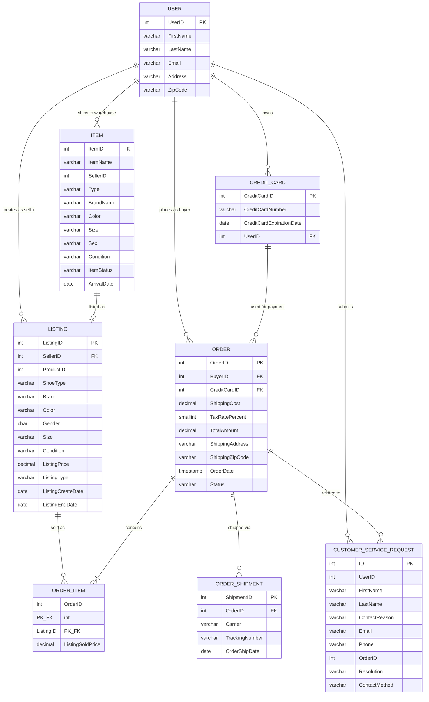

# SneakerPark Enterprise Conceptual Data Model

## Entity-Relationship Diagram (Crow's Foot Notation)

## Entity Descriptions

### Subject Area: CUSTOMERS

**USER**
- Represents both buyers and sellers in the SneakerPark marketplace
- All users must have active accounts to transact
- Source System: User Service (usr schema)

**CREDIT_CARD**
- Payment methods associated with user accounts
- Used for processing orders
- Source System: User Service (usr schema)

**CUSTOMER_SERVICE_REQUEST**
- Records of customer support interactions
- Tracks support requests from calls and emails
- Source System: Customer Service Application (cs schema)
- Note: Isolated system with nightly batch exports

### Subject Area: INVENTORY

**ITEM**
- Physical sneakers received at SneakerPark warehouse
- Assigned ItemID upon authentication
- Tracks authentication status and condition
- Source System: Inventory Management System (im schema)
- Note: Isolated system with nightly batch exports, current data only

### Subject Area: LISTINGS

**LISTING**
- Seller-created listings for authenticated items
- Must be created within 45 days of item receipt
- Can be auction-style or fixed price
- Source System: Listing Service (li schema)

### Subject Area: ORDERS

**ORDER**
- Purchase transactions in the marketplace
- Can be from bids or direct purchases
- Source System: Order Processing Service (op schema)

**ORDER_ITEM**
- Individual listings included in an order
- Junction table linking orders to listings
- Records final sale price
- Source System: Order Processing Service (op schema)

**ORDER_SHIPMENT**
- Shipment tracking for completed orders
- Ships from SneakerPark warehouse to buyer
- Source System: Order Processing Service (op schema)

## Relationship Details

### Cardinality and Optionality

1. **USER to CREDIT_CARD** (1 to many, optional)
   - One user may have zero or many credit cards
   - Each credit card belongs to exactly one user

2. **USER to LISTING** (1 to many, optional)
   - One user (as seller) may create zero or many listings
   - Each listing is created by exactly one seller

3. **USER to ORDER** (1 to many, optional)
   - One user (as buyer) may place zero or many orders
   - Each order is placed by exactly one buyer

4. **USER to CUSTOMER_SERVICE_REQUEST** (1 to many, optional)
   - One user may submit zero or many service requests
   - Each request relates to one user

5. **USER to ITEM** (1 to many, optional)
   - One user (as seller) may ship zero or many items to warehouse
   - Each item is shipped by one seller

6. **CREDIT_CARD to ORDER** (1 to many, optional)
   - One credit card may be used for zero or many orders
   - Each order uses exactly one credit card

7. **LISTING to ORDER_ITEM** (1 to many, optional)
   - One listing may be sold in zero or many order items (though typically 0 or 1)
   - Each order item references exactly one listing

8. **ORDER to ORDER_ITEM** (1 to many, mandatory)
   - One order must contain at least one order item
   - Each order item belongs to exactly one order

9. **ORDER to ORDER_SHIPMENT** (1 to many, optional)
   - One order may have zero or many shipments
   - Each shipment belongs to exactly one order

10. **ORDER to CUSTOMER_SERVICE_REQUEST** (1 to many, optional)
    - One order may have zero or many related service requests
    - Each service request may optionally relate to one order

11. **ITEM to LISTING** (1 to 0 or 1, optional)
    - One item may be listed zero or one times
    - Each listing corresponds to one item (via ProductID/ItemID linkage)

## Business Rules Reflected in Model

1. **Authentication Flow**: Items must arrive at warehouse before listings can be created
2. **45-Day Rule**: Items not listed within 45 days are returned (ITEM.ItemStatus tracking)
3. **Payment Requirement**: All orders must use a registered credit card
4. **Account Requirement**: All transactions require active user accounts
5. **Marketplace Duality**: Users can act as both buyers and sellers
6. **Service Tracking**: Customer service requests can exist independently or relate to specific orders

## Data Integration Notes

- **Strong Integration**: User Service ↔ Listing Service ↔ Order Processing Service
- **Weak Integration**: Inventory Management System (isolated, batch exports)
- **Weak Integration**: Customer Service Application (isolated, batch exports)
- **Expected Issues**: Data inconsistencies due to limited integration between systems
- **Denormalization**: CustomerServiceRequests contains user data (FirstName, LastName, Email) that duplicates USER entity

## System Mapping

- **usr schema**: USER, CREDIT_CARD
- **li schema**: LISTING
- **op schema**: ORDER, ORDER_ITEM, ORDER_SHIPMENT
- **im schema**: ITEM
- **cs schema**: CUSTOMER_SERVICE_REQUEST

---

*This conceptual model provides the foundational understanding of SneakerPark's data landscape and will guide subsequent MDM and data quality initiatives.*
