# Master Data Management Architecture for SneakerPark

## Recommended MDM Style: **HYBRID APPROACH**

---

## MDM Architecture Diagram

```mermaid
graph TB
    subgraph External["External Interfaces"]
        WebApp["SneakerPark.com<br/>Web Application"]
        Mobile["Mobile App"]
        API["Public API"]
    end

    subgraph CriticalSystems["Critical Systems (99.999% Uptime)"]
        USR["User Service<br/>(usr schema)<br/>━━━━━━━━━━<br/>👤 Users<br/>💳 Credit Cards<br/>━━━━━━━━━━<br/>Real-time"]
        OP["Order Processing<br/>(op schema)<br/>━━━━━━━━━━<br/>🛒 Orders<br/>📦 Order Items<br/>🚚 Shipments<br/>━━━━━━━━━━<br/>Real-time"]
        CS["Customer Service<br/>(cs schema)<br/>━━━━━━━━━━<br/>📞 Support Tickets<br/>━━━━━━━━━━<br/>Real-time + Batch"]
    end

    subgraph ModerateSystems["Moderate Criticality (99.99% Uptime)"]
        LI["Listing Service<br/>(li schema)<br/>━━━━━━━━━━<br/>📋 Listings<br/>━━━━━━━━━━<br/>Real-time"]
    end

    subgraph LowCritical["Lower Criticality (99% Uptime)"]
        IM["Inventory Management<br/>(im schema)<br/>━━━━━━━━━━<br/>📦 Items<br/>🏭 Warehouse<br/>━━━━━━━━━━<br/>Batch (Nightly)"]
    end

    subgraph MDMHub["🎯 MDM HUB - Hybrid Architecture"]
        subgraph Centralized["CENTRALIZED Component"]
            GoldenCustomer["Golden Customer Records<br/>━━━━━━━━━━━━━━━━<br/>Master Customer Data<br/>• Unique Customer ID<br/>• Verified Name<br/>• Verified Address<br/>• Verified Email<br/>• Merged Duplicates<br/>━━━━━━━━━━━━━━━━<br/>Source of Truth"]
        end

        subgraph Registry["REGISTRY Component"]
            CrossRef["Cross-Reference Index<br/>━━━━━━━━━━━━━━━━<br/>Item Mappings<br/>• ItemID → ListingID<br/>• ProductID → ItemID<br/>• Seller Mappings<br/>━━━━━━━━━━━━━━━━<br/>Lightweight Index"]
        end

        MatchEngine["Matching Engine<br/>━━━━━━━━━━<br/>Fuzzy Matching<br/>Deduplication<br/>Reconciliation"]

        DataQuality["Data Quality Engine<br/>━━━━━━━━━━<br/>Validation Rules<br/>Quality Scoring<br/>Issue Detection"]

        Workflow["Workflow Manager<br/>━━━━━━━━━━<br/>Steward Alerts<br/>Approval Process<br/>Conflict Resolution"]
    end

    subgraph DataGov["Data Governance Layer"]
        Steward["Data Stewards<br/>━━━━━━━━━━<br/>Jessica (Lead)<br/>CS Team<br/>Warehouse Team"]
        Monitor["Monitoring Dashboard<br/>━━━━━━━━━━<br/>DQ Metrics<br/>MDM Health<br/>Sync Status"]
    end

    subgraph Integration["Integration Layer"]
        ETL["ETL Processes<br/>━━━━━━━━━━<br/>Batch Jobs (Nightly)<br/>• IM → MDM Hub<br/>• CS → MDM Hub<br/>━━━━━━━━━━<br/>Change Data Capture"]

        RealTime["Real-Time Sync<br/>━━━━━━━━━━<br/>Event-Driven<br/>• USR ↔ MDM Hub<br/>• OP ↔ MDM Hub<br/>• LI ↔ MDM Hub<br/>━━━━━━━━━━<br/>Message Queue"]
    end

    %% External to Critical Systems
    WebApp --> USR
    WebApp --> OP
    WebApp --> LI
    Mobile --> USR
    Mobile --> OP
    API --> USR

    %% Critical Systems to MDM Hub (Real-Time - REGISTRY style)
    USR <-->|"Real-time Sync<br/>Customer Data"| RealTime
    OP <-->|"Real-time Sync<br/>Order Data"| RealTime
    LI <-->|"Real-time Sync<br/>Listing Data"| RealTime

    RealTime --> CrossRef
    RealTime --> GoldenCustomer

    %% Isolated Systems to MDM Hub (Batch - CENTRALIZED style)
    IM -->|"Nightly Batch<br/>Item Data"| ETL
    CS -->|"Nightly Batch<br/>Support Data"| ETL

    ETL --> CrossRef
    ETL --> GoldenCustomer

    %% MDM Hub Internal
    CrossRef --> MatchEngine
    GoldenCustomer --> MatchEngine
    MatchEngine --> DataQuality
    DataQuality --> Workflow
    Workflow --> Steward

    %% Governance
    Steward --> Monitor
    Monitor --> MDMHub
    DataQuality --> Monitor

    %% MDM Hub back to Systems (Master Data Distribution)
    GoldenCustomer -.->|"Publish Master<br/>Customer Data"| RealTime
    CrossRef -.->|"Publish<br/>Item Mappings"| ETL

    style MDMHub fill:#e6f3ff,stroke:#0066cc,stroke-width:4px
    style Centralized fill:#ffe6e6,stroke:#cc0000,stroke-width:2px
    style Registry fill:#e6ffe6,stroke:#00cc00,stroke-width:2px
    style CriticalSystems fill:#fff0e6,stroke:#ff9900,stroke-width:2px
    style ModerateSystems fill:#f0fff0,stroke:#66cc66,stroke-width:2px
    style LowCritical fill:#f0f0ff,stroke:#6666cc,stroke-width:2px
    style DataGov fill:#fff9e6,stroke:#ccaa00,stroke-width:2px
    style Integration fill:#f5f5f5,stroke:#666666,stroke-width:2px
```



---

## Detailed Architecture Explanation

### Chosen Approach: **Hybrid MDM**

SneakerPark requires a **Hybrid MDM Architecture** that combines elements of both **Registry** and **Centralized** styles to address the unique challenges of their system landscape.

---

## Rationale for Hybrid Approach

### Why NOT Pure Registry?

**Registry Style** is too lightweight for SneakerPark's needs:

❌ **Problems with Pure Registry:**
1. **Data Quality Issues**: Current data has significant quality problems (name mismatches, missing values) that need active cleansing, not just indexing
2. **No Single Source of Truth**: Registry only indexes; it doesn't resolve conflicts or establish authoritative data
3. **Limited Governance**: Cannot enforce data quality rules or stewardship workflows
4. **Fragmented Customer View**: Customer data exists in 3 systems (usr, cs, op) with inconsistencies - registry won't fix this

✅ **Registry Elements We Need:**
- Lightweight cross-referencing for Items across Inventory and Listings
- Low overhead for high-uptime systems (99.999% requirement for Order Processing)
- Performance for real-time lookups

---

### Why NOT Pure Centralized?

**Centralized Style** is too disruptive for SneakerPark's operations:

❌ **Problems with Pure Centralized:**
1. **System Disruption**: Order Processing Service is CRITICAL (99.999% uptime). Cannot afford migration or redirection through hub
2. **High Implementation Risk**: Replacing existing systems would cause business disruption
3. **Performance Bottleneck**: All transactions through hub could slow down order processing
4. **Organizational Resistance**: Jake and teams are already firefighting - major system overhaul would overwhelm them

✅ **Centralized Elements We Need:**
- Golden Customer records to resolve name/address inconsistencies
- Data quality engine to enforce business rules
- Stewardship workflows for issue resolution
- Master data authority for customer entities

---

### Why NOT Pure Consolidation?

**Consolidation Style** doesn't solve SneakerPark's real-time needs:

❌ **Problems with Pure Consolidation:**
1. **Read-Only Limitation**: Consolidation creates analytical views but doesn't flow master data back to operational systems
2. **Stale Data**: Reporting-only approach doesn't fix real-time customer data issues in Customer Service system
3. **No Operational Impact**: Doesn't improve day-to-day operations or prevent data quality issues at entry point

---

## Hybrid Architecture Components

### 1. **CENTRALIZED Component: Golden Customer Records**

**Purpose**: Establish single source of truth for customer data

**Scope**:
- **Master Entities**: Customer (person), Address, Contact Information
- **Source Systems**: usr.users (primary), cs.CustomerServiceRequests (secondary), op.Orders (secondary)
- **Flow**: Bi-directional sync with source systems

**Why Centralized for Customers:**
- Critical data quality issues (name mismatches, duplicates)
- Regulatory compliance (GDPR, data retention)
- High-value entity requiring stewardship
- Appears in 3+ systems with inconsistencies
- Need to merge/deduplicate accounts

**Implementation**:
```
User Service (usr.users) ──┐
                           ├──> Golden Customer Hub ──> Publish to all systems
Customer Service (cs)     ──┤      (Centralized)
                           │
Order Processing (op)     ──┘
```

**Master Data Attributes**:
- CustomerID (Golden ID)
- FirstName, LastName (verified, cleaned)
- Email (primary, verified)
- Address, ZipCode (standardized)
- CreatedDate, LastModifiedDate
- DataQualityScore
- SourceSystemIDs (cross-reference)

---

### 2. **REGISTRY Component: Item Cross-Reference**

**Purpose**: Link items across Inventory and Listings without data duplication

**Scope**:
- **Indexed Entities**: Items, Products, Listings
- **Source Systems**: im.Items (Inventory), li.listings (Listings)
- **Flow**: Lightweight index with pointers to source systems

**Why Registry for Items:**
- Low criticality for ItemID/ProductID linkage
- Inventory system is isolated (batch sync, 99% uptime)
- Listing service is moderately critical (99.99% uptime)
- Item data is already reasonably clean
- Performance-sensitive (must not slow down listings)
- No major data quality issues requiring centralization

**Implementation**:
```
Inventory (im.Items) ──┐
                       ├──> Cross-Reference Index ──> Fast lookup
Listings (li)         ──┘      (Registry)
```

**Cross-Reference Index**:
| ItemID (im) | ProductID | ListingID (li) | SellerID | Status | LastSyncDate |
|-------------|-----------|----------------|----------|--------|--------------|
| 2333        | 509       | 922399         | 25516    | Listed | 2020-10-06   |
| 2333        | 509       | 493279         | 58233    | Listed | 2020-10-05   |

---

### 3. **Integration Layer: Dual-Mode**

#### Real-Time Sync (for Critical Systems)
- **Systems**: User Service, Order Processing, Listing Service
- **Technology**: Change Data Capture (CDC) + Message Queue (Kafka/RabbitMQ)
- **Latency**: < 1 second
- **Pattern**: Event-driven, asynchronous
- **Uptime Impact**: Minimal (async, non-blocking)

**Flow**:
```
usr.users changes ──> CDC ──> Message Queue ──> MDM Hub processes ──> Publish back
```

#### Batch Sync (for Isolated Systems)
- **Systems**: Inventory Management, Customer Service
- **Technology**: Nightly ETL jobs
- **Latency**: Next day
- **Pattern**: Extract-Transform-Load
- **Uptime Impact**: None (runs during off-hours)

**Flow**:
```
im.Items ──> Nightly ETL (3:00 AM) ──> MDM Hub ──> Reconciliation ──> Update cross-ref
```

---

### 4. **Data Quality Engine**

**Purpose**: Enforce data quality rules from Part 3

**Capabilities**:
- **Validation**: Check incoming data against rules (e.g., Size 0.5-22, non-NULL ShoeType)
- **Scoring**: Assign quality scores to records (0-100)
- **Flagging**: Mark records for steward review
- **Metrics**: Feed dashboard with DQ metrics

**Rules Enforced**:
1. Every listing must have ShoeType
2. Customer names must match User Service
3. Sizes must be valid (0.5-22)
4. Every item must have ArrivalDate
5. No duplicate accounts (same email/name/address)

**Quality Scoring**:
```
Record Quality Score = (
  + 20 points for completeness (no NULLs)
  + 20 points for validity (values in range)
  + 20 points for consistency (matches across systems)
  + 20 points for uniqueness (no duplicates)
  + 20 points for timeliness (recent update)
) / 100
```

---

### 5. **Matching Engine**

**Purpose**: Identify duplicates and link entities across systems

**Techniques**:
- **Deterministic Matching**: Exact key matches (UserID, ItemID)
- **Probabilistic Matching**: Fuzzy logic for customer deduplication
- **Rule-Based Matching**: Business rules from Part 6

**Matching Rules** (See Part 6 for full details):
- **Customer Matching**: Email + Name similarity, or Address + Phone
- **Item Matching**: Brand + Color + Size + Condition, or SellerID + ItemID

---

### 6. **Workflow Manager**

**Purpose**: Manage stewardship and conflict resolution

**Workflows**:
1. **New Customer Registration**: Auto-check for duplicates → Flag if match score > 80% → Steward reviews
2. **Name Mismatch Detected**: Alert steward → Verify correct name → Update golden record → Publish to systems
3. **Missing Data**: Flag incomplete records → Assign to data owner → Track resolution
4. **Merge Request**: Identify duplicate accounts → Steward approves merge → Consolidate history → Update golden ID

**Stewardship Queue**:
```
┌───────┬──────────────────────┬──────────┬───────────┬──────────┐
│ ID    │ Issue                │ Priority │ Assigned  │ Status   │
├───────┼──────────────────────┼──────────┼───────────┼──────────┤
│ DQ-01 │ Name mismatch        │ High     │ Jessica   │ Open     │
│ DQ-02 │ Duplicate customer   │ Medium   │ CS Team   │ In Work  │
│ DQ-03 │ Missing ShoeType     │ Low      │ Auto-fix  │ Resolved │
└───────┴──────────────────────┴──────────┴───────────┴──────────┘
```

---

## Phased Implementation Plan

### Phase 1: Foundation (Months 1-2)
- Set up MDM Hub infrastructure (database, ETL tools)
- Implement Cross-Reference Index for Items (Registry component)
- Establish nightly batch sync from Inventory and CS systems
- Build basic monitoring dashboard

**Impact**: Low (no changes to critical systems)

### Phase 2: Customer Golden Records (Months 3-4)
- Design Golden Customer schema
- Implement Matching Engine for customer deduplication
- Load historical customer data from usr.users
- Begin cleansing and merging duplicates (stewardship)

**Impact**: Low (read-only from source systems)

### Phase 3: Real-Time Integration (Months 5-6)
- Implement CDC for User Service
- Set up message queue (Kafka/RabbitMQ)
- Enable bi-directional sync usr.users ↔ Golden Customer
- Cutover Customer Service to read from MDM Hub for customer lookups

**Impact**: Medium (requires careful testing, but non-disruptive architecture)

### Phase 4: Data Quality Automation (Months 7-8)
- Deploy Data Quality Engine with validation rules
- Implement workflow manager and stewardship queue
- Train data stewards (Jessica, CS team, warehouse team)
- Enable real-time DQ alerts

**Impact**: Medium (process changes for teams)

### Phase 5: Full Hybrid Operation (Months 9-12)
- Extend CDC to Order Processing and Listing Service (carefully, given uptime requirements)
- Implement golden customer distribution to all systems
- Full deduplication and conflict resolution
- Retire manual data fixes and spreadsheets

**Impact**: High (full operational benefit)

---

## Benefits of Hybrid Approach for SneakerPark

### ✅ Minimally Disruptive
- Order Processing Service (critical 99.999%) remains untouched until Phase 5
- No "big bang" migration
- Phased rollout reduces risk
- Systems continue operating during implementation

### ✅ Right Tool for Right Job
- **Centralized** for complex, high-value Customer data requiring stewardship
- **Registry** for simpler Item linking requiring performance
- Not forcing one-size-fits-all approach

### ✅ Addresses Data Quality Issues
- Centralized component enables active data cleansing
- Data Quality Engine enforces rules
- Stewardship workflows manage exceptions
- Dashboard provides visibility

### ✅ Scalable Integration
- Real-time for critical systems (when ready)
- Batch for isolated systems (respects current architecture)
- Can evolve as SneakerPark's needs change

### ✅ Supports Business Growth
- Solid foundation for Phase 2 (Enterprise Data Warehouse)
- Enables future expansion (international, new product lines)
- Reduces technical debt instead of adding to it

### ✅ Realistic for Current Team
- Jake can administer infrastructure (aligns with his DB background)
- Jessica can lead stewardship (leverages her SME knowledge)
- Doesn't require hiring entire MDM team immediately
- Automation reduces firefighting workload

---

## Technology Stack Recommendation

### MDM Hub Platform
- **Option 1**: Informatica MDM (Commercial, enterprise-grade)
- **Option 2**: Talend MDM (Open Source / Commercial hybrid)
- **Option 3**: Custom-built on PostgreSQL + Python (Cost-effective, leverages existing skills)

**Recommendation**: Start with **Talend MDM Open Source** for Phase 1-2, upgrade to commercial if needed

### Integration Tools
- **CDC**: Debezium (open source, PostgreSQL support)
- **Message Queue**: Apache Kafka (industry standard for event streaming)
- **ETL**: Apache Airflow (workflow orchestration) + Python scripts

### Monitoring & Governance
- **Dashboard**: Apache Superset (from Part 4 recommendation)
- **Data Catalog**: Apache Atlas or OpenMetadata
- **Workflow**: Jira or custom stewardship UI

---

## Success Metrics

### Technical KPIs
- MDM Hub uptime: > 99.9%
- Customer data quality score: > 95% (from current ~85%)
- Real-time sync latency: < 1 second
- Batch sync reliability: 100% (nightly jobs never fail)

### Business KPIs
- Reduction in data-related customer complaints: -50%
- Reduction in mischarges/lost revenue: -75%
- Time to resolve data issues: -60%
- Data steward time spent firefighting: -80%

### Data Quality KPIs (From Part 4)
- Missing ShoeType: < 2% (from current 15.2%)
- Name mismatches: < 0.5% (from current 3.8%)
- Invalid sizes: 0% (from current 0.2%)
- Missing ArrivalDate: < 1% (from current 8.7%)
- Duplicate accounts: 0 new duplicates

---

## Risks and Mitigation

### Risk 1: Performance Impact on Order Processing
**Mitigation**:
- Async, non-blocking integration
- Extensive load testing before production
- Rollback plan if latency increases
- Phase 5 only after Phases 1-4 proven stable

### Risk 2: Data Migration Issues
**Mitigation**:
- Parallel run (MDM Hub + existing systems) for 3 months
- Reconciliation reports to verify data accuracy
- Gradual cutover, one system at a time
- Never delete source data during migration

### Risk 3: Team Capacity
**Mitigation**:
- Hire 1-2 MDM specialists for implementation
- Extensive training for Jake and Jessica
- Phased approach allows learning time
- Vendor support for chosen MDM platform

### Risk 4: Business Process Change Resistance
**Mitigation**:
- Executive sponsorship and communication
- Quick wins in Phase 1-2 to build momentum
- Involve system owners (CS team, warehouse) early
- Show tangible benefits (fewer data issues, less firefighting)

---

## Conclusion

The **Hybrid MDM Architecture** is the optimal choice for SneakerPark because it:

1. **Respects System Constraints**: Doesn't disrupt critical Order Processing (99.999% uptime)
2. **Solves Real Problems**: Addresses customer data quality issues through Centralized approach
3. **Maintains Performance**: Uses Registry for item lookage where appropriate
4. **Enables Governance**: Provides stewardship workflows and data quality enforcement
5. **Scalable & Pragmatic**: Can evolve with SneakerPark's growth and Phase 2 initiatives

This architecture positions SneakerPark for success in their Enterprise Data Management journey while minimizing risk and disruption.

---

*Architecture designed for SneakerPark's unique combination of critical uptime requirements, isolated legacy systems, and pressing data quality needs.*
